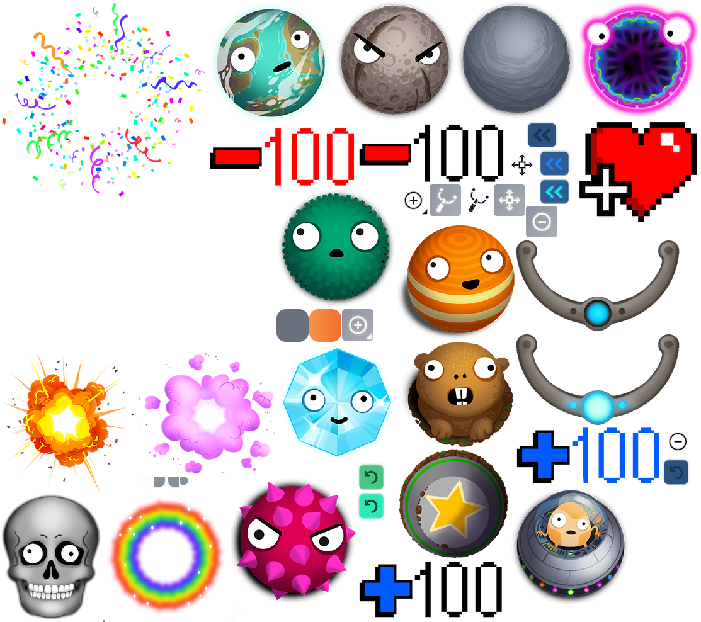

	
## Coding

### Texture assets
Fizzics image textures files are located at `raw_assets/images/balls/` as simple *.png* files. However, these assets are merged into a single image file using a non-free software tool called [TexturePacker](https://www.codeandweb.com/texturepacker). You can download the mentioned tool [here](https://www.codeandweb.com/texturepacker/download). In the case you are using Endless OS, you will have to unlock your system in order to install the *.deb* package.  It is recommended to use the trial or PRO version since it prevents the texture being generated with color issues. 



To edit the texture properly, you should open the file `raw_assets/images/fizzics.tps` with TexturePacker.
Once you edit the texture, you should publish your work at `assets/atlases/fizzics.json`. This is the path where Fizzics looks for textures. As mentioned before, publish it using the PRO or trial version of TexturePacker, otherwise color issues will appear. 


### Level configuration
Balls are positioned in the LevelView of Fizzics following the settings from the file located at `assets/jsones/GameLevels.json`. This file indicate how many balls of certain type and at what position to add per level.

### Design pattern
The project follows an Model-View-Controller design pattern based on the library created by the same original authors of the Fizzics port. This library is called [mvcx](https://github.com/koreezgames/mvcx).

You can see a simple example of how different objects interact [here](https://github.com/koreezgames/mvcx/tree/master/example).

#### Phaser and configuration
The game uses Phaser3 and Phaser settings can be found at the file `index.ts`. 
**Physics engine**
Fizzics uses the [MatterJS](https://github.com/liabru/matter-js) engine for physics simulation. This is used to simulate gravity, attraction among other features. Examples can be found at this [link](https://labs.phaser.io/index.html?dir=physics/matterjs/&q=). Also, MatterJS has a plugin called *[attractors](https://github.com/liabru/matter-attractors)* that is used to add the feature of attraction to the Fizzics game.

> Warning: Types like Phaser.Math.Vector2 or the Body class are not accessible. In the case of vectors, just use simple objects like {x: 0, y: 0}.

#### Model:
**VO files**
 Classes like *BallVO* or *BallTypeVO* contain the plain information of every object representation.  **Do not edit attributes of these objects directly.**
 
**VOProxy files**
Classes like `BallsVOProxy` or `BallTypesVOProxy` contain methods that modify underlying VO objects. So for example, if you want to update the *BallTypeVO.radius* attribute, do not do it directly but do the following:

```
// const ballsVOProxy = this.facade.retrieveProxy(BallsVOProxy); // In a Mediator
const ballsVOProxy = this.retrieveProxy(BallsVOProxy); // In a Controller
const specie = 0; // It can be from 0 to 4.
ballsVOProxy.updateRadius(specie, 50);

```

Current implementation only calls `retrieveProxy` from proxies, controllers, mediators and observants. You may want to avoid calling it from other parts of the code. 
*Avoid calling `retrieveProxy` from a View class. If you need that, then do it from its Mediator class.*

**Mediators**
Subscribe to event changes and build the view. They can pass info from VO objects to their implementing views. For example, before the *LevelView* gets instantiated, the *LevelViewMediator* gets called, subscribing to different events and then calling the `LevelView.build` method passing to it an array of `BallVO` that will be used to add the balls to the level.

**Observants**
They subscribe to events to listen when some of them occurs. They are currently used in Fizzics  to know when to emit a sound or when to change the cursor style, or in the case of collision they send a notification whenever a collision occurs to create the rainbow or explosion effect when two balls collides.

**Controllers**
Every action you want to perform in the game, like going one level back or forward, start the game, add or remove a ball should be performed in controllers. *You should never call a controller directly*. 

Controllers are registered in the `FizzicsFacade.ts` file in the method `initializeController`. For example, to register a controller called `nextLevelCommand`, do the following:

```
public  initializeController(): void {
    super.initializeController();
    this.registerCommand(UIEvents.NextLevel, nextLevelCommand);
}
```

and in the `Controllers` folder creat a `NextLevelCommand.ts` file containing a function of a similar name starting with lower case: `nextLevelCommand`: 

```
export  function  nextLevelCommand(e: string, increment: number): void {
    // Do some stuff here.
}
```

You should never call `nextLevelCommand` directly. Instead, whenever you want to call this function, you should send a notification wieth registered event.

```
this.facade.sendNotification(UIEvents.NextLevel); // From the Mediator.
```

#### Global parameters
The Hack toolbox, the desktop and web version, change current state of the game by modifying properties of the GlobalParameters. Beware of setting properties that go out from the value range. Unfortunately, the Fizzics version does not check this range value. In the future it should be implemented, but for now you should manually check that you set a valid value. To know about the value ranges you can look at the code [here](https://github.com/endlessm/hack-toolbox-app/blob/master/src/Fizzics/model.js).

This allows you to change properties at running time. Try to open the web inspector, and type `window.globalParameter.radius_0 = 50`. The radius of the main orange ball will be changed.

**Adding support for a new parameter**
Whever you update a value in the GlobalParemeters, like in the example above, the `globalParametersUpdate` function from *FizzicsGame.ts* is called, which at the same time executes the command `globalParametersUpdateCommand` that calls methods on VOProxies to modify underlying data on VO objects. So, if you are going to add a new parameter, modify that method, modify that function, and also modify the file `constants.ts.` with the default values and `endless.ts`.

